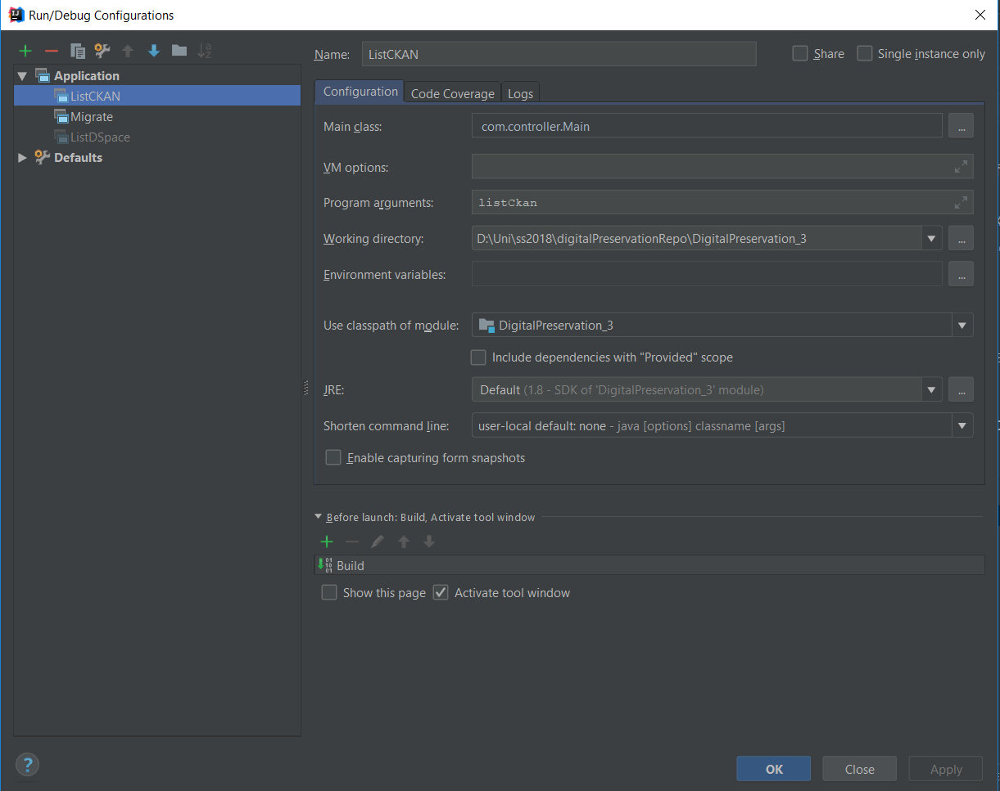

# DigitalPreservation_3

To build the project: mvn clean install

Configuration: fill the resources/config file with the correct DSpace and CKAN repository URLs, as 
well as with the CKAN API Key (can be found under CKAN user profile)

Usage: listDspace | listCkan | migrate

To start the project: start the Main class with the wanted argument

Intellij:
In Intellij, running configuration can be used.

